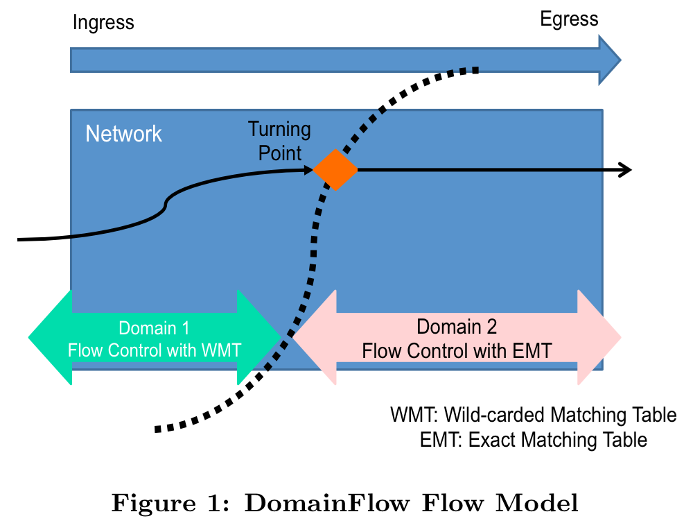
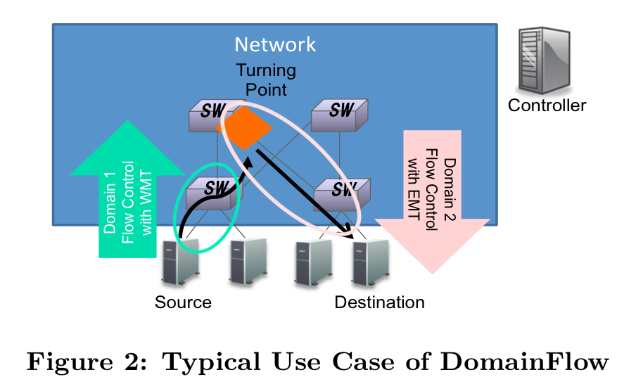
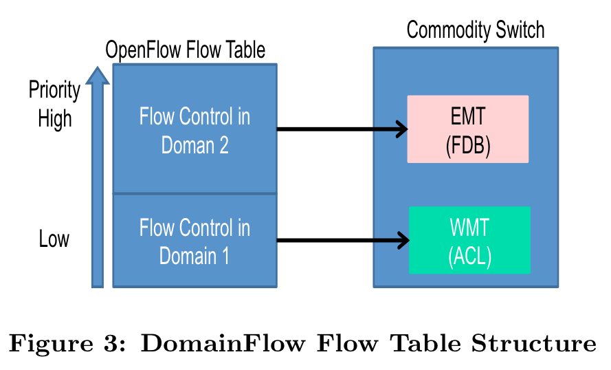
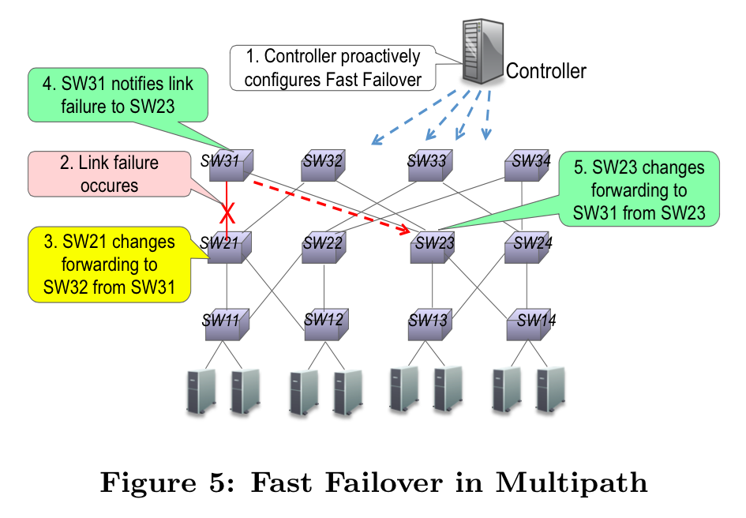
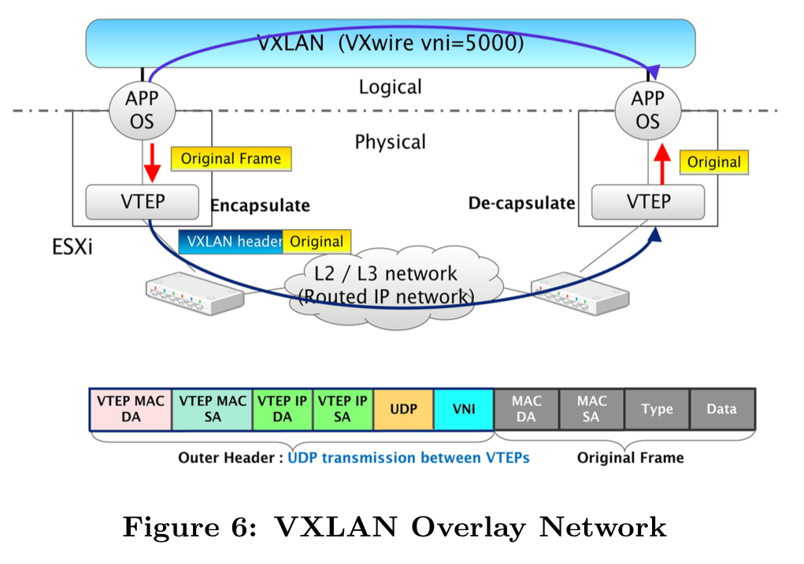
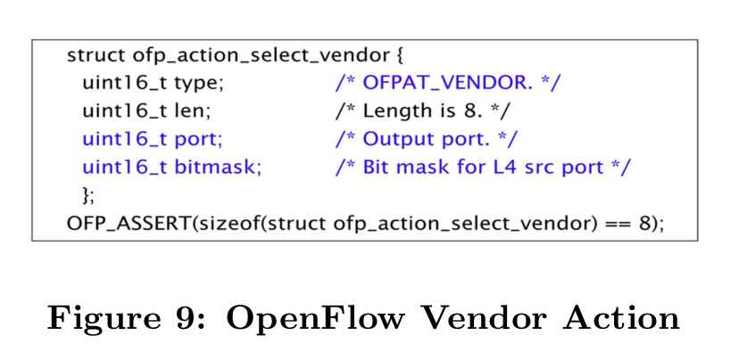
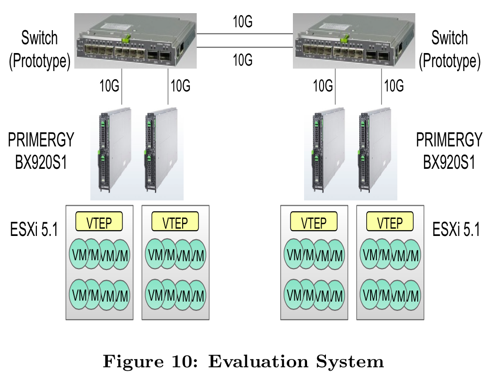
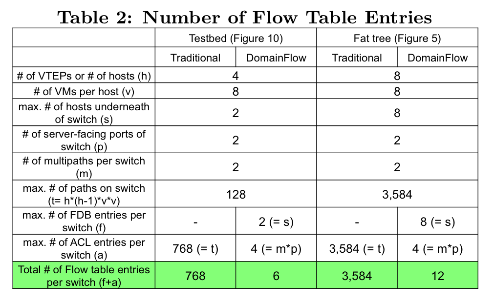
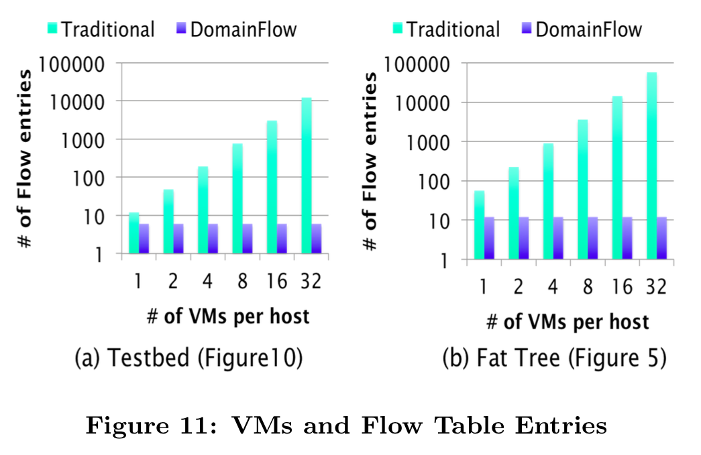

20141119 Wireless Internet Laboratory meeting

## Introduction

-  The demand for bandwidth between servers inside a data center is rapidly
   increasing
   -  High bisection bandwidth and high availability
   -  Efficient use of multiple paths between pair of end hosts
-  The controller needs to use switch hardware resources or multiple flow tables
   efficiently for constructing a scalable network
-  OpenFlow is not sufficient for fast failover for high availability in the
   multipath
-  DomainFlow: a practical flow management using OpenFlow for commodity switches

## Background

### TCAM for Wild-carded Matching Rule

-  Ethernet switches uses TCAMs to implement wild-carded OpenFlow rules
-  TCAM consumes much higher area and power per entry than SRAM
   -  On-chip TCAM sizes are typically limited to a few thousand entries

### Overhead for Flow Level Management

-  Efficient multipath usage is possible by selecting path for every flow
-  The number of matching rules increases when we specify each flow for
   multipath distribution
-  Specify each flow for multipath distribution increases the number of matching
   rules
   -  OpenFlow requires `h*(h-1)*v*v` wild-carded matching rules for traffic
      distribution
-  OpenFlow-based path selection is limited due to the switch hardware resources
-  OpenFlow provides a group action to select path from multiple output ports
   -  The distribution algorithm is not defined in the specification

### Fast Failover for High Availability

-  OpenFlow defines a fast failover mechanism for the controller to specify the
   alternate port
   -  Enabling the switch to change forwarding without requiring a round trip to
      the controller
   -  However, it does not work with multiple switches in the multipath

## DomainFlow

### DomainFlow Flow Model

-  The flow model consists of two domains
   -  Controller configures the boundary (turning point) on a per flow basis
-  In Domain 1
   -  A flow is controlled with a wild-carded matching table (WMT)
   -  For path selection
   -  The flow is handled by the WMT if destination lookup failure (DLF) occurs
      in the EMT
-  In Domain 2
   -  A flow is controlled with an exact matching table (EMT)
   -  For unicast, multicast, broadcast packets
   -  If DLF occurs, handled by the controller
-  Using proactive mode to reduce the flow setup overhead

### DomainFlow Use Case

-  DomainFlow can be used in various types of applications
   -  Path selection in multipath networks with tree structure
   -  End-host mode to represent servers
   -  Forwarding of FCoE (Fibre Channel over Ethernet) traffic to FCF (FCoE
      Forwarder)
-  Domain 1 is defined in which no destination exists at the server-facing ports
   of a switch
-  Domain 2 is defined in which a destination exists at the server-facing ports
   of a switch
-  The upward flow from a source server is controlled with the WMT towards the
   turning point
-  The downward flow is controlled with the EMT towards a destination server

### DomainFlow Flow Table Structure

-  A commodity switch normally has both an EMT and WMT
   -  The EMT is implemented as a forwarding database (FDB) using SRAM
   -  The WMT is implemented as an access control list (ACL) using TCAM
-  The priority of EMT is higher than that of WMT
-  Use bit maksing to further reduce the number of WMT entries

### Fast Failover in Multipath

-  The controller proactively configures a group type of Fast Failover
-  This mechanism works only when a switch detects a link failure on the
   directly connected link
-  Notify other affected switches about the link failure
-  Appropriately change forwarding without intervention of the controller

## Application

Applied the DomainFlow method to multipath flow management in the VXLAN overlay
network to enable network virtualization

### VXLAN Packet Encapsulation

-  VXLAN tunnel end point (VTEP) originates and terminates VXLAN tunnels
-  Additional headers are Outer Ethernet, Outer IP, Outer UDP, and VXLAN
-  The VXLAN header includes 24 bits of VXLAN network identifier (VNI)

### Multipath Traffic Distribution

-  Traffic from/to virtual machines is aggregated/disaggregated at a VTEP
-  It is important to distribute traffic in multipath networks reflecting
   original payloads for high performance
   -  The UDP source port of the outer header to be a hash of the inner Ethernet
      frame's header

### DomainFlow Flow Management

-  OpenFlow Vendor Action is of the form:

## Protype & Evaluation

### Switch Prototype

-  Based on OpenFlow 1.0
-  Running an OpenFlow agent connected to the switch
   -  Communicates with the controller over secure channel
   -  Configures the switch using the enhanced CLI

### Preliminary Evaluation Results

-  Can be implemented using a commodity switch
-  Small number of flow table entries

### Flow Table Efficiency

-  Traditional method installed matching rules in the TCAM
-  DomainFlow use FDB and ACL to reduce the total number of flow entries

## Conclusion

-  Multipath flow management is possible with a small number of flow entries
   -  Bit masking and wild-carded matching in Domain 1
   -  Exact matching in Domain 2
-  Fast failover using OpenFlow for commodity switches
-  Applied a prototype of DomainFlow
   -  Reducing the total number of flow entries to 1/128

## Questions

-  Use bit masking on what to reduce the WMT entries
-  Wild-carded matching
-  Overlay network
-  OpenFlow Fast Failover mechanism
-  Vendor action for path selection

## Notes

### VXLAN

-  VNI stands for "VXLAN Network Identifier" (or VXLAN Segment ID)
-  The term "VXLAN segment" is used interchangeably with the term "VXLAN overlay
   network"
-  The end point of the tunnel (VXLAN Tunnel End Point or VTEP) is located
   within the hypervisor on the server that hosts the VM
-  VMs in different VXLAN overlay networks cannot communicate with each other

### TCAM

-  TCAM 以內容查找地址，與一般 memory 不同
-  一般 memory 中每個 bit 只能表示兩個值：0 與 1。而 TCAM 每個 bit
   可以表示三個值：0、1 與 X，X 表示 don't care
-  TCAM 的一條 entry 在物理上是用兩條 entry 所組成，一條放
   data、另一條存放相應的 mask。因此可實現 0/1/X 的表示
-  TCAM 可支持各種 lookup key 任意組合查找，任意 mask 掉任何不關心的字段
-  一條 TCAM entry 至少抵得上五條 DRAM/SRAM entry，如果晶片內部放了太大的 TCAM
   會導致晶片成本和功耗直線上升

## References

-  [DomainFlow: Practical Flow Management Method using Multiple Flow Tables in
   Commodity
   Switches](http://conferences.sigcomm.org/co-next/2013/program/p399.pdf)
-  [Multi-path Dijkstra Algorithm & ECMP](http://z956.logdown.com/posts/167516-ecmp)
