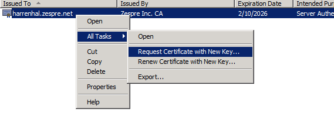

## Generate Certificate and Key pair

To import the certificate with its private key, you can do the following:

1. Pack the certificate and its private key into a PKCS #12 file or PFX file
   using `openssl pkcs12`.
1. Import this PKCS #12 or PFX file into the certificate store.

```bash
openssl pkcs12 -inkey harrenhal.zespre.net.key \
    -in harrenhal.zespre.net.crt \
    -export -out harrenhal.zespre.net.pfx
```

## Settings on Windows Side

Download the PFX.

`mmc` Snap-in



To check the connection is actually being encrypted, you can use `openssl
s_client` to connect to the remote desktop service. See what you will get:

```bash
openssl s_client -connect harrenhal.zespre.net:3389 | openssl x509 -noout -text
```

## References

-  [How to Force Remote Desktop Services on Windows 7 to Use a Custom Server
   Authentication Certificate for
   TLS](https://support.microsoft.com/en-us/kb/2001849)
-  [How to import an OpenSSL key file into the Windows Certificate
   Store](http://stackoverflow.com/questions/15671476/how-to-import-an-openssl-key-file-into-the-windows-certificate-store)
