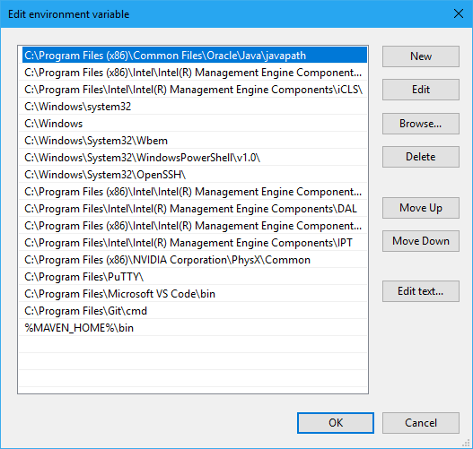
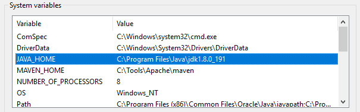

Check path environment variable



Check Java home environment variable



Replacing the following three files under `C:\Program Files (x86)\Common
Files\Oracle\Java\javapath` with the right ones.

-  `java.exe`
-  `javaw.exe`
-  `javaws.exe`

Configuring registry settings using `regedit.exe`:

```text
Key: HKEY_LOCAL_MACHINE\SOFTWARE\JavaSoft\Java Runtime Environment
Name: CurrentVersion
Value: 1.8
```
