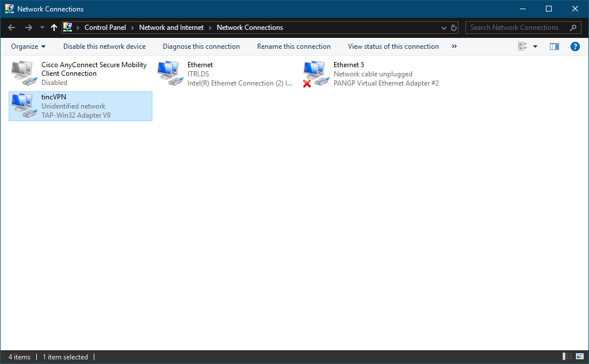
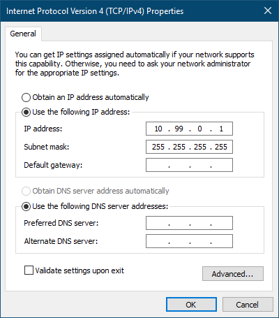
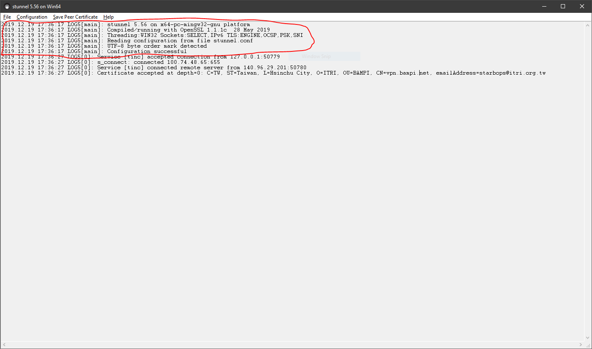

## Server-Side

### Installation

```bash
sudo apt install build-essential automake libssl-dev liblzo2-dev libbz2-dev zlib1g-dev
wget https://tinc-vpn.org/packages/tinc-1.0.33.tar.gz
tar -xf tinc-1.0.33.tar.gz
cd tinc-1.0.33
./configure --prefix=
make
sudo make install
```

### Configuration

`/etc/stunnel`

```text
pid = /var/run/stunnel.pid

[tincd]
cert = /etc/stunnel/vpnserver.crt
key = /etc/stunnel/vpnserver.key
accept = 100.74.48.65:655
connect = 127.0.0.1:655
```

```bash
sudo mkdir -p /etc/tinc/shpVPN/hosts
```

`/etc/tinc/shpVPN/tinc.conf`

```text
Name = vpnserver
Device = /dev/net/tun
AddressFamily = ipv4
```

Generating keys

```bash
sudo tincd -n shpVPN -K
```

`/etc/tinc/shpVPN/hosts/vpnserver` with 600

```text
Address = 100.74.48.65
BindToAddress = 127.0.0.1
Port = 655
Subnet = 10.99.0.100/32
Subnet = 10.5.0.0/16
-----BEGIN RSA PUBLIC KEY-----
...
...
...
-----END RSA PUBLIC KEY-----
```

`/etc/tinc/shpVPN/hosts/desktop` with 600

```text
Subnet = 10.99.0.1/32
-----BEGIN RSA PUBLIC KEY-----
...
...
...
-----END RSA PUBLIC KEY-----
```

`/etc/tinc/shpVPN/tinc-up`

```bash
#!/bin/sh
ip link set $INTERFACE up
ip addr add 10.99.0.100 dev $INTERFACE
ip route add 10.99.0.0/24 dev $INTERFACE
```

`/etc/tinc/shpVPN/tinc-down`

```bash
#!/bin/sh
ip route del 10.99.0.0/24 dev $INTERFACE
ip addr del 10.99.0.100 dev $INTERFACE
ip link set $INTERFACE down
```

`/etc/systemd/system/tinc.service`

```text
[Unit]
Description=Tinc net shpVPN
After=network.target

[Service]
Type=simple
WorkingDirectory=/etc/tinc/shpVPN
ExecStart=/sbin/tincd -n shpVPN -D -d3
ExecReload=/sbin/tincd -n shpVPN -kHUP
TimeoutStopSec=5
Restart=always
RestartSec=60

[Install]
WantedBy=multi-user.target
```

```bash
sudo chmod -v +x /etc/tinc/shpVPN/tinc-{up,down}
```

### Running

```bash
sudo tincd -n shpVPN -D -d3
```

Or

```bash
sudo systemctl start tinc.service
```

## Client-Side

### Installation

Reboot Windows 10 without driver signature checking. To permanently disable
Windows 10's driver signature check, start `cmd.exe` with administrator
privilege and execute:

```powershell
C:\Windows\system32>bcdedit.exe /set nointegritychecks on
```

Then reboot again.

To add an software emulated network interface, start `cmd.exe` with
administrator authority to execute `addtap.bat`:

```powershell
C:\Program Files (x86)\tinc\tap-win64>addtap.bat

C:\Program Files (x86)\tinc\tap-win64>rem Add a new TAP virtual ethernet adapter

C:\Program Files (x86)\tinc\tap-win64>cd /d C:\Program Files (x86)\tinc\tap-win64\

C:\Program Files (x86)\tinc\tap-win64>tapinstall.exe install OemWin2k.inf tap0901
Device node created. Install is complete when drivers are installed...
Updating drivers for tap0901 from C:\Program Files (x86)\tinc\tap-win64\OemWin2k.inf.
Drivers installed successfully.

C:\Program Files (x86)\tinc\tap-win64>pause
Press any key to continue . . .
```

### Configuration



```powershell
C:\Users\A70001.ITRI>netsh interface set interface name="Ethernet 4" newname="tincVPN"
```



```powershell
C:\Users\A70001.ITRI>netsh interface ip set address name="tincVPN" source=static address=10.99.0.1 mask=255.255.255.255 gateway=none
```

`C:\Program Files (x86)\stunnel\config\stunnel.conf`

```text
[tinc]
client = yes
accept = 127.0.0.1:9487
connect = 100.74.48.65:655
CAfile = vpnserver.crt
verify = 4
```

Copy `vpnserver.crt` on VPN server to VPN client under `C:\Program Files
(x86)\stunnel\config`.

Create `shpVPN` folder under `C:\Program Files (x86)\tinc` and then run the
following command to generate RSA keys for the VPN client:

```bash
C:\Program Files (x86)\tinc>tincd.exe -n shpVPN -K
```

The above command will generate new key pair for the client. You will need to
update corresponding part of `desktop` file on both server and client.

`C:\Program Files (x86)\tinc\shpVPN\tinc.conf`

```text
Name = desktop
Interface = tincVPN
ConnectTo = vpnserver
```

`C:\Program Files (x86)\tinc\shpVPN\hosts\desktop`

```text
Subnet = 10.99.0.1/32
-----BEGIN RSA PUBLIC KEY-----
MIIBCgKCAQEAuUVnc6xF7tLEt0o4yJ6EYbuVnLBNHYhO8COXwcb+d/VZ2zlGG6rL
mz75iGFp/2WCO48Q8aODctbY04Y26j4K8YnzRQkLrxao6qeKEbSQCqDziqY4W5lu
ZWBjZCEjA8B5/XRNPhDl4i2/MYeVsiY6GLSrxOe0FNE/R3oRU2YUCtugcPU1FNFm
BsjPIhhOLQsbZTmnmf7yuYvQllo9m7yl3tOeo7gJ2P4qbI6k9WcwuFOFHjgX4uFG
MevJhLKh906Qw8nrRudGR06311WAC9QGu42ublv33gRzsfz1Fn+xxBW1wQXcvQmE
P/rgaut7PTHN2o9eVH4po9g+PqkvUJkSIwIDAQAB
-----END RSA PUBLIC KEY-----
```

`C:\Program Files (x86)\tinc\shpVPN\hosts\vpnserver`

```text
Address = 127.0.0.1
Port = 9487
Subnet = 10.99.0.100/32
Subnet = 10.5.0.0/16
-----BEGIN RSA PUBLIC KEY-----
MIIBCgKCAQEA0ZAGqivOCx7qMRgt5TUyOMHN1jFBzhRzSQlN/L/smJ9HSpK/GLLl
O9t8vwWq123bUPoxTfhg2fL6WZod5W/CSfNROvOciY+io2AtVUh+byUc1I+frY2T
17Zf0/tGhLk1t2mrnTXwH6wCXtfss2OCkL7Q90SRgEj4a/FsETcZjKa49scWWg88
zkzPpXNl1e0mZqvse2T/umyXjzeJUJvrRqtW8Me/thpHnnY7sK95Vf9ky0YuBAnh
3kOCEhXLEtItqQ11d5NUjXFdXKa9s7yu8JcWHG7HDnobE2CzxHDB2AZoqFkJSQO1
OY2YF6XxVFGCSFReejERVwc3jAWiTtzohwIDAQAB
-----END RSA PUBLIC KEY-----
```

### Running

First we need to kickoff `stunnel`. Open Windows start menu and search for
"stunnel Service Install". This will install `stunnel` as a service so that it
will start at system boot up. And the second step is search for "stunnel Service
Start" to actually start the `stunnel` service. After a few seconds there's a
little popup window shows that it is running. But how can I tell it is running
without any issue?

To make sure that `stunnel` is running without any problems, open log window of
`stunnel` by clicking the little icon in bottom right system tray. If there's no
that kind of icon, just open Windows start menu and search for "stunnel GUI
Start" (please make sure `stunnel` is not running yet, because doing this will
start the service which is duplicated and failed to start). A correctly
configured `stunnel` service's log should look like this (red circle part):



If `stunnel` is good, then we can start up `tincd`:

```powershell
C:\Program Files (x86)\tinc>tincd.exe -n shpVPN -D -d3
```

## Routing

On VPN server:

```bash
sudo sysctl -w net.ipv4.ip_forward=1
```

On VyOS router:

```bash
$ conf
# set protocols static route 10.99.0.0/24 next-hop 10.5.0.65 distance 1
# save
```

On VPN client:

```powershell
C:\Windows\system32>netsh interface ipv4 show interfaces

Idx     Met         MTU          State                Name
---  ----------  ----------  ------------  ---------------------------
  1          75  4294967295  connected     Loopback Pseudo-Interface 1
  5          25        1500  connected     Ethernet
 16          20        1400  disconnected  Ethernet 3
 14          55        1500  disconnected  tincVPN

C:\Windows\system32>route -p ADD 10.5.0.0 MASK 255.255.0.0 10.99.0.100 IF 14
 OK!
```

## Troubleshooting

Windows Firewall

## References

-  [How to Set up tinc, a Peer-to-Peer
   VPN](https://www.linode.com/docs/networking/vpn/how-to-set-up-tinc-peer-to-peer-vpn/)
-  [How to install and configure tinc on Windows 7 and Ubuntu 10.10 Linux and
   CentOS
   5](https://wiki.cementhorizon.com/display/CH/How+to+install+and+configure+tinc+on+Windows+7+and+Ubuntu+10.10+Linux+and+CentOS+5)
-  [TAP installer failed on Windows 10 1709 with
   2.4.6](https://forums.openvpn.net/viewtopic.php?t=26280)
-  [GitHub - OpenVPN/tap-windows6: Windows TAP driver (NDIS
   6)](https://github.com/OpenVPN/tap-windows6)
-  [Quick & Easy: Tinc 1.1pre15 VPN between Windows
   Systems](https://nwgat.ninja/quick-easy-tinc-vpn-between-windows-systems/)
-  [Setting Up a VPN with Tinc VPN
   Software](http://learnlinuxonline.com/servers/setting-up-a-vpn-with-tinc-vpn-software/)
-  [How To Encrypt Traffic to Redis with Stunnel on Ubuntu
   16.04](https://www.digitalocean.com/community/tutorials/how-to-encrypt-traffic-to-redis-with-stunnel-on-ubuntu-16-04)
-  [Private VPN with
   TINC](http://xtittle.blogspot.com/2013/01/private-vpn-with-tinc.html)
-  [How Do I Reach Local Subnet Behind Tinc
   VPN](https://serverfault.com/questions/640020/how-do-i-reach-local-subnet-behind-tinc-vpn)
-  [tinc.conf.5](https://www.tinc-vpn.org/documentation/tinc.conf.5)
-  [Static routing - VyOS Wiki](https://wiki.vyos.net/wiki/Static_routing)
-  [How to Add a Static TCP/IP Route to the Windows Routing
   Table](https://www.howtogeek.com/howto/windows/adding-a-tcpip-route-to-the-windows-routing-table/)
