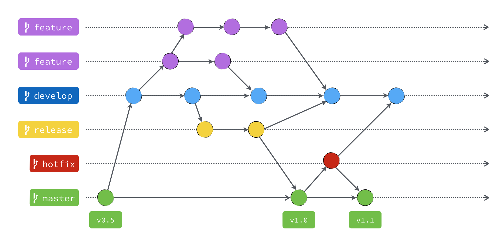

-  Main branches
   -  master :+1:
      -  Production-ready
   -  develop :crossed_swords:
      -  Branch-off from the master
      -  Main branch for the development :heavy_check_mark:
      -  Suppose to be always stable
-  Supporting branches
   -  feature :rocket:
      -  branch name: `feature/JIRA-298`
      -  Branch-off from the develop
      -  Where new feature to work on
      -  Need to be tested
   -  hotfix :ambulance:
      -  branch name: `hotfix/JIRA-352`
      -  Merge back to master and develop
   -  release :recycle:
      -  branch name: `release/0.1`
      -  Integration testing
      -  Only fixing bugs
      -  Continuously merge back to develop
      -  When everything is fine merge to master
