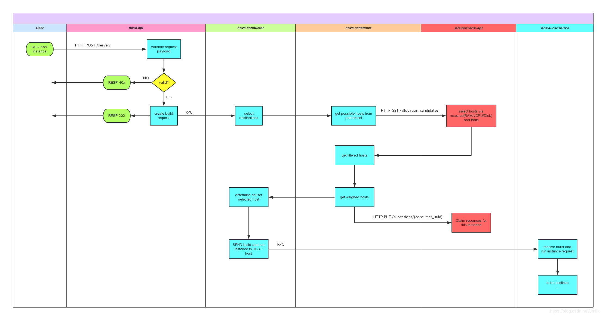

Placement API is a separate REST API stack and data model used to track resource
provider **inventories** and **usages**, along with different **classes** of
resources.

## Concepts

### Resource Providers

### Resource Classes

The types of resources consumed are tracked as classes.

-  VCPU
-  MEMORY_MB
-  DISK_GB
-  ...

The nova-compute service code will begin reporting resource provider inventory
and usage information as soon as the placement API service is in place and can
respond to requests via the endpoint registered in the service catalog.

## Workflows

The scheduler gets the allocation candidates from the placement API and uses
those to get the compute nodes, which come from the cell(s). The compute nodes
are passed through the enabled scheduler filters and weighers. The scheduler
then iterates over this filtered and weighed list of hosts and attempts to claim
resources in the placement API for each instance in the request. Claiming
resources involves finding an allocation candidate that contains an allocation
against the selected host's UUID and asking the placement API to allocate the
requested instance resources. We continue performing this claim request until
success or we run out of allocation candidates, resulting in a `NoValidHost`
error.



## Caveats

The `nova.scheduler.filter_scheduler.FilterScheduler` in Ocata will fallback to
not using the Placement service as long as there are older `nova-compute`
services running in the deployment. This allows for rolling upgrades of the
computes to not affect scheduling for the FilterScheduler. However, the fallback
mechanism will be removed in the 16.0.0 Pike release such that the scheduler
will make decisions based on the Placement service and the resource providers
(compute nodes) registered there, This means if the computes are not reporting
into Placement by Pike, build requests will fail with `NoValidHost` errors.

## Command Examples

```bash
$ openstack --os-placement-api-version=1.17 \
    resource provider list
+--------------------------------------+-----------------+------------+--------------------------------------+----------------------+
| uuid                                 | name            | generation | root_provider_uuid                   | parent_provider_uuid |
+--------------------------------------+-----------------+------------+--------------------------------------+----------------------+
| a294054e-cfc3-4393-af2e-b5b1ad6022e4 | nova-compute-vm |          2 | a294054e-cfc3-4393-af2e-b5b1ad6022e4 | None                 |
+--------------------------------------+-----------------+------------+--------------------------------------+----------------------+
$ openstack --os-placement-api-version=1.17 resource class list
+-------------------+
| name              |
+-------------------+
| VCPU              |
| MEMORY_MB         |
| DISK_GB           |
| PCI_DEVICE        |
| SRIOV_NET_VF      |
| NUMA_SOCKET       |
| NUMA_CORE         |
| NUMA_THREAD       |
| NUMA_MEMORY_MB    |
| IPV4_ADDRESS      |
| VGPU              |
| VGPU_DISPLAY_HEAD |
+-------------------+
$ openstack --os-placement-api-version=1.17 \
    resource provider inventory list a294054e-cfc3-4393-af2e-b5b1ad6022e4
+----------------+------------------+----------+----------+-----------+----------+--------+
| resource_class | allocation_ratio | max_unit | reserved | step_size | min_unit |  total |
+----------------+------------------+----------+----------+-----------+----------+--------+
| VCPU           |              2.0 |     1000 |        0 |         1 |        1 |   1000 |
| MEMORY_MB      |              1.0 |   800000 |      512 |         1 |        1 | 800000 |
| DISK_GB        |              1.0 |   500000 |        0 |         1 |        1 | 500000 |
+----------------+------------------+----------+----------+-----------+----------+--------+
$ openstack --os-placement-api-version=1.17 \
    resource provider inventory show a294054e-cfc3-4393-af2e-b5b1ad6022e4 VCPU
+------------------+-------+
| Field            | Value |
+------------------+-------+
| allocation_ratio | 2.0   |
| max_unit         | 1000  |
| reserved         | 0     |
| step_size        | 1     |
| min_unit         | 1     |
| total            | 1000  |
+------------------+-------+
$ openstack --os-placement-api-version=1.17 \
    resource provider usage show a294054e-cfc3-4393-af2e-b5b1ad6022e4
+----------------+-------+
| resource_class | usage |
+----------------+-------+
| VCPU           |     0 |
| MEMORY_MB      |     0 |
| DISK_GB        |     0 |
+----------------+-------+
$ openstack --os-placement-api-version=1.17 \
    allocation candidate list --resource VCPU=1
+---+------------+--------------------------------------+-------------------------+--------+
| # | allocation | resource provider                    | inventory used/capacity | traits |
+---+------------+--------------------------------------+-------------------------+--------+
| 1 | VCPU=1     | a294054e-cfc3-4393-af2e-b5b1ad6022e4 | VCPU=0/2000             |        |
+---+------------+--------------------------------------+-------------------------+--------+
```

## References

-  [OpenStack Docs: Placement
   API](https://docs.openstack.org/nova/rocky/user/placement.html)
-  [OpenStack Docs: Placement
   Service](https://docs.openstack.org/placement/stein/install/)
