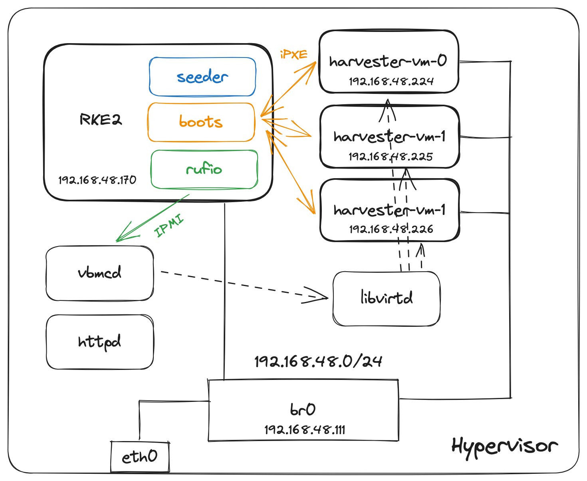
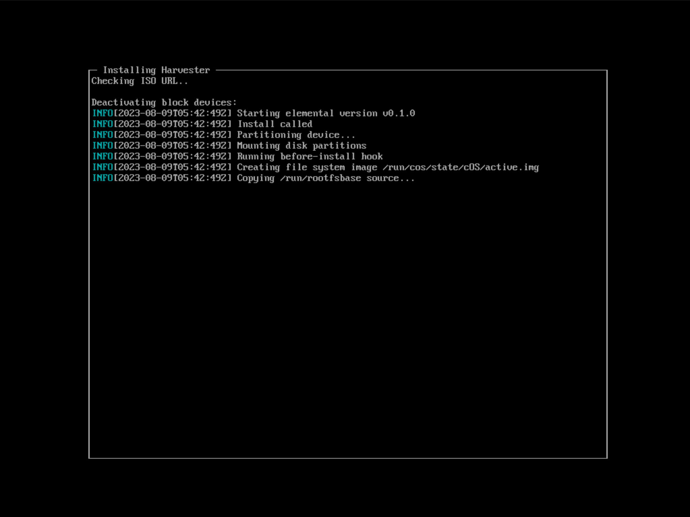
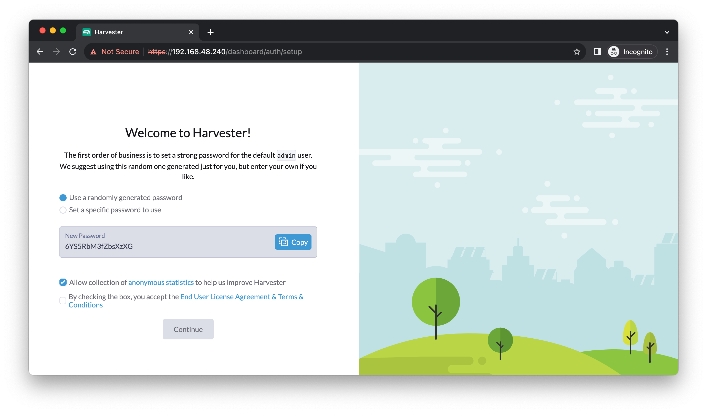
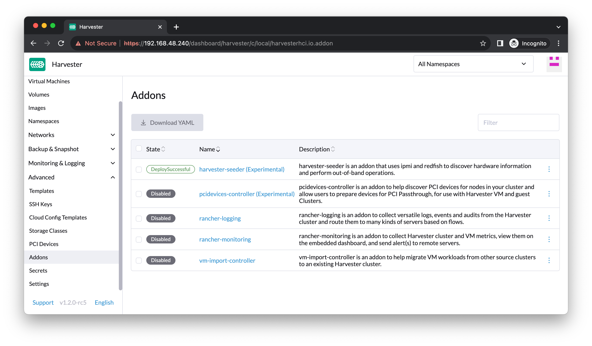
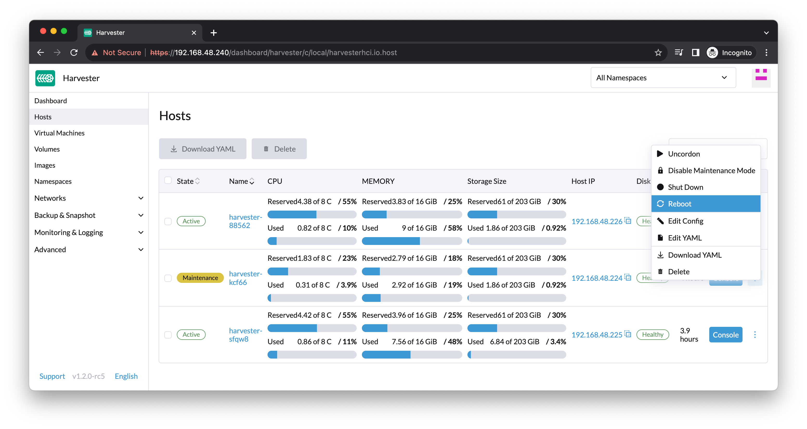

The Harvester team often uses the
[ipxe-examples](https://github.com/harvester/ipxe-examples) to spin up live and
VM-based clusters for development and testing. This write-up introduces an
alternative way of doing it. By leveraging the [VirtualBMC
project](https://opendev.org/openstack/virtualbmc), it's possible to use
[Seeder](https://github.com/harvester/seeder) to provision Harvester clusters
with virtual machines.

## Background

### Harvester HCI

> [Harvester](https://harvesterhci.io/) is a modern, open,
> interoperable, [HCI](https://en.wikipedia.org/wiki/Hyper-converged_infrastructure) solution
> built on Kubernetes. It is an open-source alternative designed for operators
> seeking a [cloud-native](https://about.gitlab.com/topics/cloud-native/) HCI
> solution. Harvester runs on bare metal servers and provides integrated
> virtualization and distributed storage capabilities. In addition to
> traditional virtual machines (VMs), Harvester supports containerized
> environments automatically through integration
> with [Rancher](https://ranchermanager.docs.rancher.com/integrations-in-rancher/harvester).
> It offers a solution that unifies legacy virtualized infrastructure while
> enabling the adoption of containers from core to edge locations.

### Seeder

## Overview

Below is the reference architecture of the setup:



## Prerequisites

We need the following packages and tools installed to be able to proceed:

-  KVM/QEMU - needless to say, we need these to create VMs
-  Libvirt - RKE2 and Harvester nodes will be created using libvirt APIs
-  virt-install - for creating domain definitions (XMLs)
-  NGINX - for serving Harvester artifacts (using `python3 -m http.server` would
   work, too)
-  noVNC - for accessing the VM consoles (optional)

## Environment Information

-  Hypervisor
   -  IP address: 192.168.48.111/24
-  Networking (bridge mode)
   -  Bridge name: `br0`
   -  Subnet: 192.168.48.0/24
   -  Gateway: 192.168.48.1

## Setup

### Kubernetes

Any Kubernetes cluster would work. It's okay to skip this section if you
already have one. The purpose is to prepare an environment for installing
Seeder and other relevant charts. Here we [deploy an RKE2 cluster using
Terraform](https://github.com/starbops/terraform-rke2) for the completeness of
the demonstration.

```bash
git clone https://github.com/starbops/terraform-rke2.git
cd terraform-rke2/
# edit terraform.tfvars to suit your environment before applying
make tf-init
make tf-plan
make tf-apply
```

A kubeconfig file will be downloaded under the default `/tmp/rke2` directory.
You may want to specify the path of the kubeconfig file while you use commands
like `kubectl` and `helm`:

```bash
export KUBECONFIG=/tmp/rke2/rke2.yaml
```

### Seeder

Deploy Seeder on the cluster. Since we need the provisioning capability of
Seeder, it's required to turn off the `embeddedMode` flag to make it run in
standalone mode.

```bash
helm repo add harvester https://charts.harvesterhci.io
helm repo update
helm upgrade \
  --install \
  harvester-seeder \
  harvester/harvester-seeder \
  --set=embeddedMode=false \
  --namespace=seeder-system \
  --create-namespace
```

Besides the Seeder itself, we also need [Tinkerbell
Boots](https://github.com/tinkerbell/boots). It's the network boot service in
the [Tinkerbell stack](https://tinkerbell.org/) and is also required by Seeder
to provision Harvester clusters.

Note: We need a custom-built container image of Boots for Harvester
provisioning to work. Hopefully, this will no longer be required in the future.

```bash
git clone https://github.com/harvester/seeder.git
cd seeder/
helm upgrade \
  --install \
  boots \
  chart/seeder/charts/boots \
  --namespace=seeder-system \
  --create-namespace
```

### Harvester Node

Create an empty VM for iPXE boot later. This will also create storage.

Note: The MAC address should be identical to the one specified in the
corresponding Inventory CR later.

```bash
$ virt-install \
    --name=harvester-vm \
    --os-type="linux" \
    --os-variant="sles12sp5" \
    --vcpus=8 \
    --memory=16384 \
    --boot=network,hd \
    --controller=scsi,model=virtio-scsi \
    --disk=path="$HOME"/libvirt/images/harvester-vm-disk-0.img,bus=scsi,size=300 \
    --network=bridge=br0,model=virtio,mac=52:54:00:01:00:01 \
    --graphics=vnc \
    --noautoconsole \
    --print-xml | virsh define /dev/stdin
Domain harvester-vm defined from /dev/stdin
```

### VirtualBMC

Install VirtualBMC in a Python virtual environment:

```bash
mkdir virtualbmc
cd virtualbmc
python3 -m venv .venv
source .venv/bin/active
python -m pip install --upgrade pip wheel
pip install virtualbmc
```

Start the VirtualBMC daemon in the foreground. If something goes wrong, you can
easily spot the reason.

```bash
vbmcd --foreground
```

Create and start a virtual BMC associated with the VM we just created. This
will make the daemon listen on the specified port receiving IPMI requests for
the VM.

```bash
vbmc add \
  --username admin \
  --password password \
  --port 10623 \
  --address 192.168.48.111 \
  --libvirt-uri qemu:///system \
  harvester-vm

vbmc start harvester-vm
```

Make sure the virtual BMC is in `running` status and the address/port tuple is correct:

```bash
$ vbmc list
+--------------+---------+----------------+-------+
| Domain name  | Status  | Address        |  Port |
+--------------+---------+----------------+-------+
| harvester-vm | running | 192.168.48.111 | 10623 |
+--------------+---------+----------------+-------+
```

Let's verify it by using the following command:

```bash
$ ipmitool -I lanplus -H 192.168.48.111 -U admin -P password -p 10623 power status
Chassis Power is off
```

The VM should be off. Later on, it will be booted up by Seeder.

## Start Provisioning Harvester

Prepare the following manifest files:

-  AddressPool CRs: One for the nodes, the other for the VIP
-  Secret: The credentials for the virtual BMC (in our case, `admin`/`password`)
-  Inventory CR: The VM
-  Cluster CR: The Harvester cluster

In `cluster.yaml`:

```yaml
---
apiVersion: metal.harvesterhci.io/v1alpha1
kind: Cluster
metadata:
  name: foxtrot
  namespace: default
spec:
  version: "v1.1.2"
  imageURL: "http://192.168.48.111:8000/harvester"
  clusterConfig:
    nameservers:
    - 1.1.1.1
    - 8.8.4.4
  nodes:
  - inventoryReference:
      name: harvester-vm
      namespace: default
    addressPoolReference:
      name: node-pool
      namespace: default
  vipConfig:
    addressPoolReference:
      name: vip-pool
      namespace: default
```

In `inventory.yaml`:

```yaml
---
apiVersion: metal.harvesterhci.io/v1alpha1
kind: Inventory
metadata:
  name: harvester-vm
  namespace: default
spec:
  primaryDisk: /dev/sda
  managementInterfaceMacAddress: "52:54:00:01:00:01"
  baseboardSpec:
    connection:
      authSecretRef:
        name: vms
        namespace: default
      host: 192.168.48.111
      insecureTLS: true
      port: 10623
  events:
    enabled: false
    pollingInterval: 1h
```

In `secret.yaml`:

```yaml
---
apiVersion: v1
data:
  password: cGFzc3dvcmQ=
  username: YWRtaW4=
kind: Secret
metadata:
  creationTimestamp: null
  name: vms
  namespace: default
```

In `addresspool-1.yaml`:

```yaml
---
apiVersion: metal.harvesterhci.io/v1alpha1
kind: AddressPool
metadata:
  name: node-pool
  namespace: default
spec:
  cidr: "192.168.48.224/28"
  gateway: "192.168.48.1"
  netmask: "255.255.255.0"
```

In `addresspool-2.yaml`:

```yaml
---
apiVersion: metal.harvesterhci.io/v1alpha1
kind: AddressPool
metadata:
  name: vip-pool
  namespace: default
spec:
  cidr: "192.168.48.240/28"
  gateway: "192.168.48.1"
  netmask: "255.255.255.0"
```

Create the above resources using `kubectl apply -f`, and Seeder will try to
power on the VM via IPMI and install Harvester using iPXE just like usual, as
we do to bare-metal machines.



After the provisioning is done, open your browser and navigate to [https://192.168.48.240](https://192.168.48.240):


You have a fully functional Harvester cluster now!

## Misc

With the aid of VirtualBMC, we can utilize some bare-metal-specific features
provided in Harvester.

### Harvester Seeder Add-on

You can enable the `harvester-seeder` Addon if you're running Harvester v1.2.0
or later to let Harvester manage the nodes (in our case, the virtual ones).



Now, you are able to put the nodes into maintenance mode and execute power
actions against them! Please note that there must be more than one node in the
cluster to put the node into maintenance mode.


