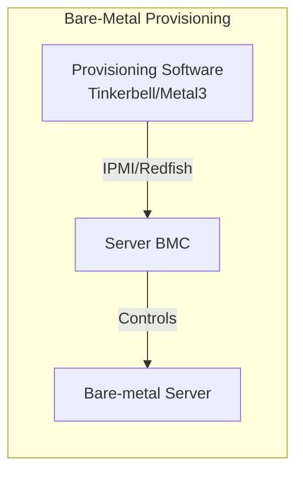
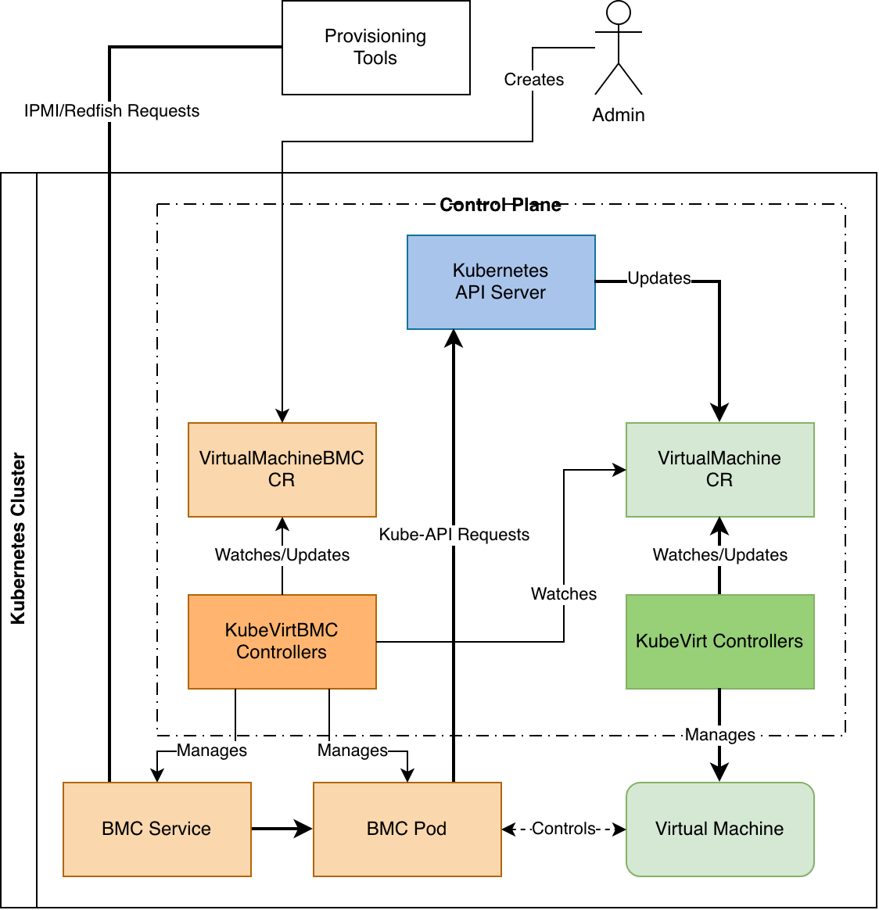
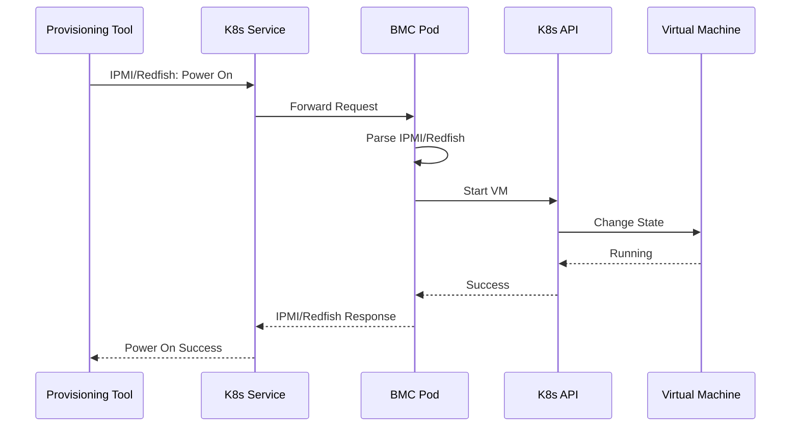

When you provision bare-metal servers using software, such as
[Tinkerbell](https://github.com/tinkerbell/tinkerbell),
[Metal3](https://github.com/metal3-io/baremetal-operator), or even
[Foreman](https://github.com/theforeman/foreman), you need a BMC
(Baseboard Management Controller) to power them on, set the boot
order, and control them remotely. But what if you want to test
your provisioning software without real hardware? Moreover, what
if your test environment runs on
[Kubernetes](https://github.com/kubernetes/kubernetes) with
[KubeVirt](https://github.com/kubevirt/kubevirt)?

[KubeVirtBMC](https://github.com/kubevirtbmc/kubevirtbmc) solves this problem.
It provides your virtual machines with a virtual BMC that mimics a real BMC.
Your provisioning software won't be able to distinguish between them. That also
implies that no source code-level modifications to the provisioning software
are required for the entire workflow to run on virtual machines.

## The Problem

Let me show you what bare-metal provisioning software expects:



These bare-metal provisioning software needs BMC to:

-  Power on servers to start OS installation
-  Set servers to boot from network (PXE)
-  Check if servers are on or off
-  Reset servers when needed

But KubeVirt virtual machines don't have BMCs. To test with
KubeVirt, you'd need to modify your provisioning software or use
workarounds. Other virtualization platforms address this with
auxiliary software such as
[VirtualBMC](https://opendev.org/openstack/virtualbmc) or
[sushy-tools](https://opendev.org/openstack/sushy-tools) from
[OpenStack](https://www.openstack.org/), but these don't integrate
well with KubeVirt because they interact directly with libvirt.
However, KubeVirt wraps libvirt into individual launcher pods,
making it hard to access from other pods or even externally.

## How KubeVirtBMC Helps

KubeVirtBMC creates a BMC emulator for each virtual machine. The
controller watches for VirtualMachineBMC custom resources and
automatically creates both a BMC pod and a Service to expose it.
Here's how it works:



Each virtual machine gets:

-  A BMC pod that understands IPMI and Redfish
-  A Service with its own IP address as the cluster-wide entry point
-  Full BMC functionality for provisioning

## Step-by-Step Setup Guide

Let's set up KubeVirtBMC and try it out. I recommend using
[Harvester HCI](https://harvesterhci.io) for setup because it
provides all the necessary components in a single package
(disclosure: I am one of the developers behind the
project/product.) If you want to try KubeVirtBMC with something
else, check the following prerequisites.

### What You Need

Before starting, make sure you have:

-  Kubernetes cluster with virtualization support on each node
-  KubeVirt installed and working
-  A storage provider installed
-  (Optional) Multus installed for networking, serving the provisioning purpose

### Step 0: Set Up KubeVirt CI

If you don't want to use a full-fledged solution like Harvester,
you can still try KubeVirtBMC on any server or in a virtual
machine (with nested virtualization enabled, of course). KubeVirt
CI can be a handy tool when developing KubeVirt. It provides the
same convenience for setting up the environment to try out
KubeVirtBMC.

```shell
git clone https://github.com/kubevirt/kubevirt.git
cd kubevirt/
export KUBEVIRT_PROVIDER=k8s-1.34
export KUBEVIRT_NUM_NODES=2
export KUBEVIRT_MEMORY_SIZE=6144M
export FEATURE_GATES=DeclarativeHotplugVolumes
export KUBEVIRT_NUM_SECONDARY_NICS=1
make cluster-up
```

This gives you a running Kubernetes cluster, but without KubeVirt
installed. Now, build and deploy KubeVirt into the cluster (this
will take some time).

```shell
make cluster-sync
```

After KubeVirt is installed, we can set up the kubeconfig file and
some more handy shortcuts and tools:

```shell
export KUBECONFIG=$(./kubevirtci/cluster-up/kubeconfig.sh)
alias kubectl=./kubevirtci/cluster-up/kubectl.sh
curl https://raw.githubusercontent.com/helm/helm/main/scripts/get-helm-3 | bash
```

```shell
$ kubectl get nodes
NAME     STATUS   ROLES           AGE    VERSION
node01   Ready    control-plane   107m   v1.34.3
node02   Ready    worker          106m   v1.34.3
$ kubectl get pods -A
NAMESPACE      NAME                               READY   STATUS    RESTARTS   AGE
cdi            cdi-apiserver-6cc6bcdc46-2zgkf     1/1     Running   0          5m33s
cdi            cdi-deployment-59945cb874-hj5rh    1/1     Running   0          5m33s
cdi            cdi-operator-697fd6d5b4-c6tns      1/1     Running   0          107m
cdi            cdi-uploadproxy-7787b9cc65-v2phk   1/1     Running   0          5m33s
default        local-volume-provisioner-thhwb     1/1     Running   0          107m
default        local-volume-provisioner-x692r     1/1     Running   0          106m
kube-flannel   kube-flannel-ds-kv2gq              1/1     Running   0          107m
kube-flannel   kube-flannel-ds-r62tt              1/1     Running   0          107m
kube-system    coredns-67d94d8d9b-fxfzd           1/1     Running   0          107m
kube-system    coredns-67d94d8d9b-pkg77           1/1     Running   0          107m
kube-system    etcd-node01                        1/1     Running   1          107m
kube-system    kube-apiserver-node01              1/1     Running   1          107m
kube-system    kube-controller-manager-node01     1/1     Running   1          107m
kube-system    kube-network-policies-jp6fg        1/1     Running   0          107m
kube-system    kube-network-policies-wf9wv        1/1     Running   0          107m
kube-system    kube-proxy-pk42m                   1/1     Running   0          107m
kube-system    kube-proxy-vmk9z                   1/1     Running   0          107m
kube-system    kube-scheduler-node01              1/1     Running   1          107m
kubevirt       disks-images-provider-97v99        1/1     Running   0          5m52s
kubevirt       disks-images-provider-lfgj7        1/1     Running   0          5m52s
kubevirt       virt-api-7bd584566b-lzsrh          1/1     Running   0          4m47s
kubevirt       virt-api-7bd584566b-xx4ml          1/1     Running   0          3m50s
kubevirt       virt-controller-94c9f4975-czqsr    1/1     Running   0          4m21s
kubevirt       virt-controller-94c9f4975-g5mvs    1/1     Running   0          4m21s
kubevirt       virt-handler-9cvlm                 1/1     Running   0          4m21s
kubevirt       virt-handler-gkh8d                 1/1     Running   0          4m21s
kubevirt       virt-operator-78b6c8944-c7xp6      1/1     Running   0          5m49s
kubevirt       virt-operator-78b6c8944-nbwdl      1/1     Running   0          5m49s
$ helm list -A
NAME    NAMESPACE       REVISION        UPDATED STATUS  CHART   APP VERSION
```

### Step 1: Install cert-manager

KubeVirtBMC needs certificates for its webhook server. Install cert-manager
first:

```bash
# Add the repository
helm repo add jetstack https://charts.jetstack.io
helm repo update

# Install cert-manager
helm upgrade --install cert-manager jetstack/cert-manager \
    --namespace=cert-manager \
    --create-namespace \
    --set=crds.enabled=true
```

### Step 2: Install KubeVirtBMC

```bash
# Add KubeVirtBMC repository
helm repo add kubevirtbmc https://charts.zespre.com/
helm repo update

# Install KubeVirtBMC
helm upgrade --install kubevirtbmc kubevirtbmc/kubevirtbmc \
    --namespace=kubevirtbmc-system \
    --create-namespace

# Wait for the controller manager pod becomes ready
kubectl -n kubevirtbmc-system wait --for=condition=Ready pods \
    -l app.kubernetes.io/name=kubevirtbmc
```

KubeVirtBMC is now ready to serve.

### Step 3: Create a Test Virtual Machine

First, create a disk for the virtual machine:

```bash
cat <<EOF | kubectl apply -f -
apiVersion: v1
kind: PersistentVolumeClaim
metadata:
  name: test-server-disk
  namespace: default
spec:
  accessModes:
  - ReadWriteOnce
  resources:
    requests:
      storage: 20Gi
EOF
```

Now create the VirtualMachine resource:

```bash
cat <<EOF | kubectl apply -f -
apiVersion: kubevirt.io/v1
kind: VirtualMachine
metadata:
  name: test-server
  namespace: default
spec:
  runStrategy: Always
  template:
    spec:
      domain:
        cpu:
          cores: 2
        memory:
          guest: 2Gi
        devices:
          disks:
          - name: rootdisk
            disk:
              bus: virtio
          - cdrom:
              bus: sata
            name: cdrom
          - name: cloudinit
            disk:
              bus: virtio
          interfaces:
          - name: default
            masquerade: {}
      networks:
      - name: default
        pod: {}
      volumes:
      - name: rootdisk
        persistentVolumeClaim:
          claimName: test-server-disk
      - name: cloudinit
        cloudInitNoCloud:
          userData: |
            #cloud-config
            hostname: test-server
EOF
```

The virtual machine should start immediately, but it lacks a
viable boot device. We will later perform the ISO installation
using the Redfish virtual media service supported by KubeVirtBMC.

### Step 4: Enable BMC for the Virtual Machine

Now, the important part: create a BMC for your virtual machine.
Since the VirtualMachineBMC resource references both the
VirtualMachine resource and the credential Secret, you need to
create a Secret containing the login username and password as
well.

```bash
cat <<EOF | kubectl apply -f -
---
apiVersion: v1
kind: Secret
metadata:
  name: bmc-auth-secret
  namespace: default
stringData:
  username: admin
  password: password
---
apiVersion: bmc.kubevirt.io/v1beta1
kind: VirtualMachineBMC
metadata:
  name: test-bmc
  namespace: default
spec:
  virtualMachineRef:
    name: test-server
  authSecretRef:
    name: bmc-auth-secret
EOF
```

Check if the BMC is ready:

```shell
$ kubectl wait --for=condition=Ready virtualmachinebmcs test-bmc
virtualmachinebmc.bmc.kubevirt.io/test-bmc condition met
```

```bash
# Get BMC status
$ kubectl get virtualmachinebmcs test-bmc -o yaml
apiVersion: bmc.kubevirt.io/v1beta1
kind: VirtualMachineBMC
metadata:
  annotations:
    kubectl.kubernetes.io/last-applied-configuration: |
      {"apiVersion":"bmc.kubevirt.io/v1beta1","kind":"VirtualMachineBMC","metadata":{"annotations":{},"name":"test-bmc","namespace":"default"},"spec":{"authSecretRef":{"name":"bmc-auth-secret"},"virtualMachineRef":{"name":"test-server"}}}
  creationTimestamp: "2026-02-14T03:46:21Z"
  generation: 1
  name: test-bmc
  namespace: default
  resourceVersion: "514248"
  uid: 4a9decb2-5699-428d-9a4f-b7f468ec20fe
spec:
  authSecretRef:
    name: bmc-auth-secret
  virtualMachineRef:
    name: test-server
status:
  clusterIP: 10.100.46.80
  conditions:
  - lastTransitionTime: "2026-02-14T03:46:21Z"
    message: VirtualMachine "test-server" is available
    reason: VirtualMachineFound
    status: "True"
    type: VirtualMachineAvailable
  - lastTransitionTime: "2026-02-14T03:46:21Z"
    message: Secret "bmc-auth-secret" is available
    reason: SecretFound
    status: "True"
    type: SecretAvailable
  - lastTransitionTime: "2026-02-14T03:46:21Z"
    message: ClusterIP assigned to the Service
    reason: ServiceReady
    status: "True"
    type: Ready

# Get the BMC IP address
$ BMC_IP=$(kubectl get virtualmachinebmcs test-bmc -o jsonpath='{.status.clusterIP}')
$ echo "BMC IP address: $BMC_IP"
BMC IP address: 10.100.46.80
```

### Step 5: Test with IPMI Commands

Let's test if the BMC works. Create a test pod for running client
commands:

```bash
kubectl run -it --rm ipmi-test --image=alpine -- sh
```

Inside the test pod:

```bash
# Install ipmitool
apk add ipmitool

# Set the BMC IP (use the IP from the previous step)
BMC_ENDPOINT=test-server-virtbmc.default.svc

# Check power status
ipmitool -H "$BMC_ENDPOINT" -U admin -P password power status

# Power off
ipmitool -H "$BMC_ENDPOINT" -U admin -P password power off

# Power on
ipmitool -H "$BMC_ENDPOINT" -U admin -P password power on

# Set to boot from network (PXE)
ipmitool -H "$BMC_ENDPOINT" -U admin -P password chassis bootdev pxe

# Reset the server
ipmitool -H "$BMC_ENDPOINT" -U admin -P password power reset
```

### Step 6: Test with Redfish

KubeVirtBMC also supports Redfish. Test it with curl:

```bash
kubectl run -it --rm curl-test --image=curlimages/curl -- sh
```

Inside the test pod, we will mount an installation ISO image on a
virtual machine with an empty disk to perform an interactive
installation.

```bash
# Set variables
BMC_ENDPOINT=test-server-virtbmc.default.svc

# Get system info
curl -u admin:password "http://$BMC_ENDPOINT/redfish/v1/Systems/1"

# Attach an ISO image from remote (download-based)
curl -u admin:password \
    -X POST \
    -H "Content-Type: application/json" \
    -d '{"Image": "https://releases.ubuntu.com/noble/ubuntu-24.04.3-live-server-amd64.iso", "Inserted": true}' \
    "http://$BMC_ENDPOINT/redfish/v1/Managers/BMC/VirtualMedia/CD1/Actions/VirtualMedia.InsertMedia"

# Power on
curl -u admin:password \
    -X POST \
    -H "Content-Type: application/json" \
    -d '{"ResetType":"ForceRestart"}' \
    "http://$BMC_ENDPOINT/redfish/v1/Systems/1/Actions/ComputerSystem.Reset"
```

It will take some time for the virtual machine to start again
because the virtual media we are attaching will first be
downloaded, then attached to the virtual machine as a CD-ROM
volume. During this preparation period, the status of the
VirtualMachine resource should display `WaitingForVolumeBinding`:

```shell
$ kubectl get vms test-server
NAME          AGE   STATUS                    READY
test-server   25h   WaitingForVolumeBinding   False
```

## How the Magic Works

When you send an IPMI/Redfish request, here's what happens:



The BMC pod translates IPMI and Redfish requests to Kubernetes API
calls. Simple but effective!

## Using Cloud-Native Provisioning Tools

Now you can use these virtual machines with cloud-native
bare-metal provisioning tools like Tinkerbell, Metal3, and others.
Because they run in Kubernetes, they can access BMC services
directly within the cluster. More details and use case
demonstrations will be available in upcoming articles.

### Example: Tinkerbell

In your Machine resource definition:

```yaml
---
apiVersion: v1
kind: Secret
metadata:
  name: machine-auth
  namespace: tinkerbell
type: kubernetes.io/basic-auth
stringData:
  username: admin
  password: password
---
apiVersion: bmc.tinkerbell.org/v1alpha1
kind: Machine
metadata:
  name: test-server
  namespace: tinkerbell
spec:
  connection:
    host: test-server-virtbmc.default.svc
    port: 80
    authSecretRef:
      name: machine-auth
      namespace: tinkerbell
    providerOptions:
      redfish:
        port: 80
```

### Example: Metal3

In your BareMetalHost resource definition:

```yaml
---
apiVersion: v1
kind: Secret
metadata:
  name: baremetalhost-auth
type: Opaque
stringData:
  username: admin
  password: password
---
apiVersion: metal3.io/v1alpha1
kind: BareMetalHost
metadata:
  name: test-server
spec:
  online: true
  bootMACAddress: 36:4e:ba:6f:9e:bf
  bmc:
    address: redfish+http://test-server-virtbmc.default.svc/redfish/v1/Systems/1
    credentialsName: baremetalhost-auth
  rootDeviceHints:
    deviceName: /dev/vda
```

It is also possible to perform cross-cluster provisioning. For
example, if you have a management cluster where the bare-metal
provisioning software is deployed, and the to-be-provisioned
KubeVirt virtual machines are in a different cluster, KubeVirtBMC
works well with the Ingress API. Simply add Ingress resources for
each VirtualMachineBMC you want to expose, and you can access them
externally.

## What's Next

KubeVirtBMC is actively evolving. You can view the ongoing feature
developments here. The project continues to grow and is here to
stay.

## Conclusion

KubeVirtBMC bridges the gap between bare-metal provisioning and
virtual environments. It lets you test your infrastructure
automation without physical hardware, using the same tools and
workflows. If you've ever wondered how to adapt your existing
bare-metal provisioning solutions to modern cloud-native
infrastructure like KubeVirt, check out the project at
[kubevirtbmc/kubevirtbmc](https://github.com/kubevirtbmc/kubevirtbmc).
Contributions and feedback are welcome!

Happy provisioning!
