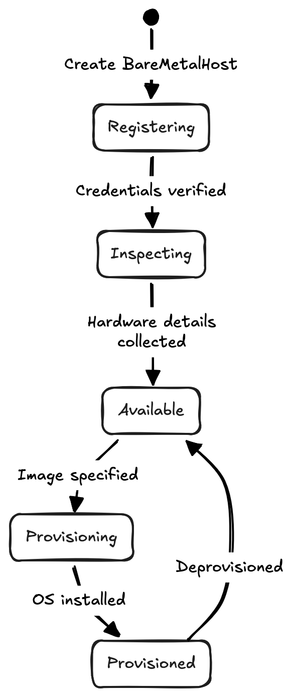
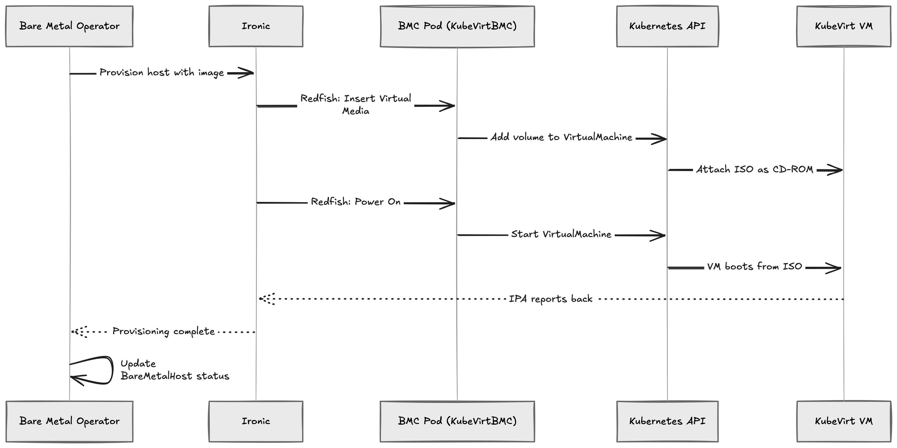

In [the previous post]()
, we introduced KubeVirtBMC and showed how it provides virtual BMC endpoints
for KubeVirt VMs. We tested it with raw IPMI and Redfish commands. That was
fun, but the real power of KubeVirtBMC shines when you pair it with actual
bare-metal provisioning tools.

In this post, we'll walk through a complete end-to-end demo: using
[Metal3](https://metal3.io/) to manage and provision KubeVirt VMs through
KubeVirtBMC—just as if they were physical servers. You'll be able to follow
along and replicate every step.

## Why Metal3?

[Metal3](https://metal3.io/) (Metal Kubed) is a CNCF Incubating project that
brings bare-metal host management into the Kubernetes ecosystem. Under the
hood, it uses [OpenStack Ironic](https://ironicbaremetal.org/) to handle the
heavy lifting—inspecting hardware, setting boot devices, and writing OS images
to disks.

The core abstraction is the `BareMetalHost` custom resource. You declare what
you want (BMC address, credentials, desired image), and Metal3 takes care of the
rest. The typical BareMetalHost lifecycle goes like this:



Metal3 expects to talk to a BMC via IPMI or Redfish. Physical servers have these
built in. KubeVirt VMs don't—unless you give them one with KubeVirtBMC.

## What We're Building

Here’s a high-level overview of the demo environment:


Everything runs in a single Kubernetes cluster. Metal3 manages `BareMetalHost`
resources that point to the virtual BMC endpoints created by KubeVirtBMC. When
Metal3 tells Ironic to power on a host or attach a boot image, Ironic sends
Redfish requests to the BMC pod. The BMC pod translates these into Kubernetes
API calls to control the KubeVirt VM. Metal3 doesn't know (or care) that it's
talking to a VM.

## Prerequisites

Before we start, make sure you have:

-  A Kubernetes cluster with virtualization support (nested virtualization or
   bare metal)
-  KubeVirt installed and functional
-  A storage provider (for VM disks)
-  `kubectl`, `helm`, and `kustomize` installed locally

If you don't have a cluster ready, refer to the [previous post]() for instructions on setting one up with KubeVirt CI, or simply using
[Harvester](https://harvesterhci.io).

## Step 1: Install cert-manager

Both KubeVirtBMC and Metal3 components require cert-manager for webhook
certificates.

```bash
helm upgrade --install cert-manager oci://quay.io/jetstack/charts/cert-manager \
    --namespace=cert-manager \
    --create-namespace \
    --set=crds.enabled=true

# Wait for cert-manager to be ready
kubectl -n cert-manager wait --for=condition=Available \
    deploy/cert-manager \
    deploy/cert-manager-webhook \
    deploy/cert-manager-cainjector \
    --timeout=120s
```

## Step 2: Install KubeVirtBMC

```bash
helm upgrade --install kubevirtbmc kubevirtbmc \
    --repo=https://charts.kubevirtbmc.io \
    --namespace=kubevirtbmc-system \
    --create-namespace

kubectl -n kubevirtbmc-system wait --for=condition=Ready pods \
    -l app.kubernetes.io/name=kubevirtbmc \
    --timeout=120s
```

Verify:

```console
$ kubectl get pods -n kubevirtbmc-system
NAME                                      READY   STATUS    RESTARTS   AGE
kubevirtbmc-controller-manager-xxxxx      1/1     Running   0          30s
```

## Step 3: Create a KubeVirt VM with BMC

We'll create a VM that simulates a bare-metal server. It needs a disk, a
network interface, and it should start in a powered-off state so that Metal3
can manage its lifecycle from scratch.

Create a PVC for the VM's root disk:

```bash
cat <<EOF | kubectl apply -f -
apiVersion: v1
kind: PersistentVolumeClaim
metadata:
  name: metal3-demo-vm-disk
  namespace: default
spec:
  accessModes:
  - ReadWriteOnce
  resources:
    requests:
      storage: 20Gi
EOF
```

Create the VirtualMachine with `runStrategy: Halted` so it stays powered off:

```bash
cat <<EOF | kubectl apply -f -
apiVersion: kubevirt.io/v1
kind: VirtualMachine
metadata:
  name: metal3-demo-vm
  namespace: default
spec:
  runStrategy: Halted
  template:
    spec:
      domain:
        cpu:
          cores: 4
        memory:
          guest: 8Gi
        devices:
          disks:
          - name: rootdisk
            disk:
              bus: virtio
          - name: cdrom
            cdrom:
              bus: sata
          interfaces:
          - name: default
            macAddress: "02:00:00:00:00:01"
            bridge: {}
        firmware:
          bootloader:
            efi:
              secureBoot: false
      networks:
      - name: default
        pod: {}
      volumes:
      - name: rootdisk
        persistentVolumeClaim:
          claimName: metal3-demo-vm-disk
EOF
```

A few things worth noting:

-  `runStrategy: Halted` keeps the VM off. Metal3 will power it on when it's
   ready.
-  We include a `cdrom` device so that KubeVirtBMC can attach virtual media (ISO
   images) via Redfish later.
-  We explicitly set `macAddress: "02:00:00:00:00:01"` on the interface. This is
   important because Metal3 requires a `bootMACAddress` for each BareMetalHost,
   and it must match an actual NIC on the machine. By pinning the MAC address
   here, we avoid the hassle of discovering a randomly generated one.
-  We use BIOS firmware for simplicity. You can switch to UEFI if your
   provisioning image requires it.

Now create the VirtualMachineBMC and its credential Secret:

```bash
cat <<EOF | kubectl apply -f -
apiVersion: v1
kind: Secret
metadata:
  name: demo-bmc-secret
  namespace: default
stringData:
  username: admin
  password: password
---
apiVersion: bmc.kubevirt.io/v1beta1
kind: VirtualMachineBMC
metadata:
  name: demo-bmc
  namespace: default
spec:
  virtualMachineRef:
    name: metal3-demo-vm
  authSecretRef:
    name: demo-bmc-secret
EOF
```

Wait for the BMC to be ready and grab its ClusterIP:

```bash
kubectl wait --for=condition=Ready virtualmachinebmcs demo-bmc --timeout=60s
```

```console
$ kubectl get virtualmachinebmcs demo-bmc
NAME       VIRTUALMACHINE   SECRET           CLUSTERIP       READY
demo-bmc   metal3-demo-vm   demo-bmc-secret  10.96.xxx.xxx   True
```

Take note of the Service name:

```console
$ kubectl get services -l kubevirt.io/virtualmachinebmc-name=demo-bmc
NAME                     TYPE        CLUSTER-IP      EXTERNAL-IP   PORT(S)          AGE
metal3-demo-vm-virtbmc   ClusterIP   10.96.xxx.xxx   <none>        80/TCP,623/UDP   58s
```

The BMC service is accessible at
`metal3-demo-vm-virtbmc.default.svc.cluster.local` within the cluster.

## Step 4: Install the Metal3 Stack

Metal3 consists of two main components: the Bare Metal Operator (BMO) and
Ironic. We'll use the [Ironic Standalone
Operator](https://book.metal3.io/irso/introduction.html) (IrSO) to deploy
Ironic, which is the recommended approach for new installations.

### Install the Ironic Standalone Operator

Install IrSO from the bleeding-edge build, as the
`ironic.spec.networking.disableHostNetwork` field had only recently been
introduced at the time of writing and was not yet included in a release.

```bash
git clone https://github.com/metal3-io/ironic-standalone-operator.git
cd ironic-standalone-operator
make install deploy

kubectl -n ironic-standalone-operator-system wait --for=condition=Available \
    deploy/ironic-standalone-operator-controller-manager \
    --timeout=120s
```

### Deploy Ironic

We'll follow the [Metal3 quickstart](https://book.metal3.io/quick-start.html)
pattern and use a kustomization to deploy both Ironic and BMO together. First,
create the namespace and the required TLS certificates:

```bash
kubectl create ns baremetal-operator-system
```

We need a TLS certificate for Ironic. Create self-signed certificates using
cert-manager:

```bash
cat <<EOF | kubectl apply -f -
apiVersion: cert-manager.io/v1
kind: Issuer
metadata:
  name: selfsigned-issuer
  namespace: baremetal-operator-system
spec:
  selfSigned: {}
---
apiVersion: cert-manager.io/v1
kind: Certificate
metadata:
  name: ironic-cacert
  namespace: baremetal-operator-system
spec:
  commonName: ironic-ca
  isCA: true
  issuerRef:
    kind: Issuer
    name: selfsigned-issuer
  secretName: ironic-cacert
---
apiVersion: cert-manager.io/v1
kind: Issuer
metadata:
  name: ca-issuer
  namespace: baremetal-operator-system
spec:
  ca:
    secretName: ironic-cacert
---
apiVersion: cert-manager.io/v1
kind: Certificate
metadata:
  name: ironic-cert
  namespace: baremetal-operator-system
spec:
  secretTemplate:
    labels:
      environment.metal3.io/ironic-standalone-operator: "true"
  dnsNames:
  - ironic.baremetal-operator-system.svc
  - ironic.baremetal-operator-system.svc.cluster.local
  issuerRef:
    kind: Issuer
    name: ca-issuer
  secretName: ironic-cert
EOF
```

In addition to TLS certificates, a set of credentials should be created to
protect the API endpoints. Otherwise, random credentials will be generated
automatically when the Ironic custom resource is created. For simplicity, we
will create them explicitly here:

```bash
cat <<EOF | kubectl apply -f -
apiVersion: v1
kind: Secret
metadata:
  labels:
    environment.metal3.io/ironic-standalone-operator: "true"
  name: ironic-credentials
  namespace: baremetal-operator-system
type: kubernetes.io/basic-auth
stringData:
  username: ironic
  password: supersecret
EOF
```

Now create the Ironic custom resource. Since we're doing virtual media-based
provisioning (no PXE/DHCP needed), the configuration is minimal:

```bash
cat <<EOF | kubectl apply -f -
apiVersion: ironic.metal3.io/v1alpha1
kind: Ironic
metadata:
  name: ironic
  namespace: baremetal-operator-system
spec:
  apiCredentialsName: ironic-credentials
  networking:
    disableHostNetwork: true
  tls:
    certificateName: ironic-cert
    disableVirtualMediaTLS: true
  version: "37.0"
EOF
```

One thing to note is that `.spec.tls.disableVirtualMediaTLS` must be set to
`true`, as we do not want dynamically generated images to be hosted on a
TLS-protected HTTP server. At the time of writing, neither KubeVirtBMC nor CDI,
the underlying component used by KubeVirtBMC for volume preparation, can
properly [handle the certificates Ironic
created](https://github.com/kubevirt/containerized-data-importer/issues/4166)
or skip certificate verification.

IrSO will use the API credentials you provided or auto-generate ones and create
the Ironic pod. Wait for it to become ready:

```bash
kubectl -n baremetal-operator-system wait --for=condition=Ready \
    ironic/ironic \
    --timeout=300s
```

> **Note:** We don't configure DHCP or a provisioning network here. For this
> demo, we rely on Redfish virtual media: Ironic attaches boot images through
> the Redfish API rather than PXE booting, so a dedicated provisioning network
> is not required.

### Install the Bare Metal Operator

Clone the baremetal-operator repository and deploy BMO:

```bash
git clone https://github.com/metal3-io/baremetal-operator.git
cd baremetal-operator
```

Create a kustomization that points BMO to the in-cluster Ironic. The recommended
approach from the [Metal3 quickstart](https://book.metal3.io/quick-start.html)
uses a kustomization overlay:

```bash
mkdir -p config/overlays/kubevirtbmc-demo

cat > config/overlays/kubevirtbmc-demo/kustomization.yaml <<EOF
apiVersion: kustomize.config.k8s.io/v1beta1
kind: Kustomization
namespace: baremetal-operator-system
resources:
- ../../default
components:
- ../../components/basic-auth
- ../../components/tls
EOF

# Configure the Ironic connection
cat > config/default/ironic.env <<EOF
DEPLOY_KERNEL_URL=
DEPLOY_RAMDISK_URL=
IRONIC_ENDPOINT=https://ironic.baremetal-operator-system.svc
IRONIC_CACERT_FILE=/opt/metal3/certs/ca/tls.crt
IRONIC_INSECURE=false
EOF
```

Deploy BMO:

```bash
kustomize build config/overlays/kubevirtbmc-demo | kubectl apply -f -

kubectl -n baremetal-operator-system wait --for=condition=Available \
    deploy/baremetal-operator-controller-manager \
    --timeout=120s
```

Verify that all Metal3 components are running:

```console
$ kubectl get pods -n baremetal-operator-system
NAME                                                      READY   STATUS    RESTARTS   AGE
baremetal-operator-controller-manager-xxxxx               1/1     Running   0          60s
ironic-service-xxxxx                                      4/4     Running   0          2m
```

## Step 5: Register the VM as a BareMetalHost

This is where the magic happens. We create a `BareMetalHost` resource that
points to the KubeVirtBMC endpoint. Metal3 doesn't know it's talking to a
virtual BMC—it just sees a standard Redfish interface.

```bash
cat <<EOF | kubectl apply -f -
apiVersion: v1
kind: Secret
metadata:
  name: metal3-demo-vm-bmc-secret
  namespace: default
stringData:
  username: admin
  password: password
---
apiVersion: metal3.io/v1alpha1
kind: BareMetalHost
metadata:
  name: metal3-demo-vm
  namespace: default
spec:
  online: true
  bootMACAddress: "02:00:00:00:00:01"
  bmc:
    address: redfish-virtualmedia+http://metal3-demo-vm-virtbmc.default.svc.cluster.local:80/redfish/v1/Systems/1
    credentialsName: metal3-demo-vm-bmc-secret
    disableCertificateVerification: true
  rootDeviceHints:
    deviceName: /dev/vda
EOF
```

A few important details on the `bmc.address` field:

-  `redfish-virtualmedia` tells Ironic to use the Redfish driver with virtual
   media support (ISO boot instead of PXE). See the [supported
   hardware](https://book.metal3.io/bmo/supported_hardware.html) page for all
   available driver types.
-  `+http` explicitly selects plain HTTP because the BMC pod does not serve
   HTTPS by default. HTTPS can be enabled through an Ingress resource, but HTTP
   is used here for simplicity. Without the `+http` suffix, Ironic defaults to
   HTTPS, causing the connection to fail.
-  The host portion `metal3-demo-vm-virtbmc.default.svc.cluster.local:80` is
   the in-cluster Service created by KubeVirtBMC.
-  `/redfish/v1/Systems/1` is the Redfish system path that KubeVirtBMC exposes.

Note that `bootMACAddress` matches the MAC address `02:00:00:00:00:01` we pinned
on the VirtualMachine interface in Step 3.

Watch the BareMetalHost go through its lifecycle:

```console
$ kubectl get bmh metal3-demo-vm -w
NAME             STATE          CONSUMER   ONLINE   ERROR   AGE
metal3-demo-vm   registering                true             5s
metal3-demo-vm   inspecting                 true             30s
metal3-demo-vm   preparing                  true             9m30s
metal3-demo-vm   available                  true             9m31s
```

During **registering**, Ironic verifies the BMC credentials by sending a Redfish
request to the KubeVirtBMC endpoint. During **inspecting**, Ironic boots the IPA
(Ironic Python Agent) ramdisk on the VM via virtual media to gather hardware
details like CPU, RAM, disk, and NIC information. Once inspection completes, the
host becomes **available** and ready for provisioning.

You can inspect the discovered hardware inventory:

```bash
kubectl get bmh metal3-demo-vm -o jsonpath='{.status.hardware}'
```

## Step 6: Provision the Host with an OS Image

Now let's provision the VM with an actual OS image. We'll use the `live-iso`
approach, which tells Ironic to boot the host from an ISO image via virtual
media. This mode is designed for integrating with site-specific
installers—Metal3 simply boots the ISO and leaves the installation to whatever
process runs inside it.

```bash
kubectl patch bmh metal3-demo-vm --type=merge -p '
{
  "spec": {
    "image": {
      "url": "https://releases.ubuntu.com/resolute/ubuntu-26.04-live-server-amd64.iso",
      "format": "live-iso"
    }
  }
}'
```

> **Note:** The `live-iso` format does not require a `checksum`—Metal3
> [does not enforce checksums](https://book.metal3.io/bmo/live-iso.html) for
> live-iso images.

If you prefer to write a disk image directly (the typical Metal3 workflow), use
a qcow2 or raw image with a checksum instead:

```bash
kubectl patch bmh metal3-demo-vm --type=merge -p '
{
  "spec": {
    "image": {
      "url": "https://cloud-images.ubuntu.com/resolute/current/resolute-server-cloudimg-amd64.img",
      "checksum": "https://cloud-images.ubuntu.com/resolute/current/SHA256SUMS",
      "checksumType": "auto",
      "format": "qcow2"
    }
  }
}'
```

Watch the provisioning progress:

```console
$ kubectl get bmh metal3-demo-vm -w
NAME             STATE          CONSUMER   ONLINE   ERROR   AGE
metal3-demo-vm   provisioning              true             5m
metal3-demo-vm   provisioned               true             12m
```

Behind the scenes, here's what happens:



The entire flow is transparent. Metal3 and Ironic use standard Redfish calls.
KubeVirtBMC translates them into Kubernetes API operations on the VirtualMachine
resource. KubeVirt handles the actual VM lifecycle.

## Step 7: Verify and Clean Up

Check the final state:

```console
$ kubectl get bmh
NAME             STATE         CONSUMER   ONLINE   ERROR   AGE
metal3-demo-vm   provisioned              true             15m

$ kubectl get vm
NAME             AGE   STATUS    READY
metal3-demo-vm   20m   Running   True
```

To deprovision (wipe the host and return it to the available pool):

```bash
kubectl patch bmh metal3-demo-vm --type=json \
    -p '[{"op": "remove", "path": "/spec/image"}]'
```

To clean up everything:

```bash
kubectl delete bmh metal3-demo-vm
kubectl delete virtualmachinebmc demo-bmc
kubectl delete secret demo-bmc-secret metal3-demo-vm-bmc-secret
kubectl delete vm metal3-demo-vm
kubectl delete pvc metal3-demo-vm-disk
```

## Gotchas and Tips

There are a few things that might trip you up when working with this setup:

-  **MAC address mismatch.** The `bootMACAddress` in BareMetalHost must match an
   actual interface on the VM. That's why we pinned it to `02:00:00:00:00:01` in
   the VirtualMachine spec. If you forget this, KubeVirt generates a random MAC
   and Ironic won't be able to match the host during inspection.
-  **HTTP vs HTTPS.** KubeVirtBMC serves Redfish over plain HTTP by default.
   Make sure to use `redfish-virtualmedia+http://` in the BMC address. Without
   the `+http` suffix, Ironic defaults to HTTPS and the connection will fail
   during registration.
-  **Virtual media vs network boot.** The `redfish-virtualmedia` driver boots
   the IPA ramdisk and provisioning images via virtual media (ISO attachment),
   which means no PXE, no DHCP, and no provisioning network is required. If you
   use the `redfish` driver (without `virtualmedia`), you'll need to set up DHCP
   and configure Ironic's networking section accordingly (we'll talk about that
   part in a future post).
-  **Ironic host networking.** By default, IrSO deploys Ironic with host
   networking enabled. The Ironic pod must be reachable from the IPA ramdisk
   running inside the VMs. If everything is running in a single cluster, this
   should work out of the box. In this article, we disable host networking
   solely for demonstration purposes, allowing us to rely on in-cluster DNS to
   resolve the Ironic service and route traffic to the underlying Ironic pod.
   In more complex network topologies, you may need to adjust the Ironic
   networking configuration.
-  **Cross-cluster scenarios.** If Metal3 runs in a different cluster than
   KubeVirt, you can expose the KubeVirtBMC Services externally using Ingress or
   NodePort. Just update the BMC address in the BareMetalHost accordingly.

## Why This Matters

This integration proves that KubeVirtBMC is not just a toy for manually sending
IPMI commands. It plugs directly into real-world, production-grade bare-metal
provisioning workflows:

-  **CI/CD for bare-metal tools.** Metal3, Ironic, and similar projects can use
   KubeVirtBMC to run their integration tests on KubeVirt VMs instead of
   maintaining a fleet of physical servers.
-  **Developer inner loop.** If you're developing bare-metal provisioning
   features, you can iterate much faster with VMs that spin up in seconds.
-  **Training and demos.** Showcasing Metal3 no longer requires a rack of
   servers. A single Kubernetes cluster with KubeVirt is enough.

## What's Next

The KubeVirtBMC project is actively evolving. There is more work underway to
improve Redfish compatibility and extend the BMC feature set. If you want to
follow the progress or contribute, head over to the [GitHub
repository](https://github.com/kubevirtbmc/kubevirtbmc).

If you've found this useful—or hit a snag while trying it out—please open an
issue or drop a comment. Feedback is what keeps open-source projects going.

Happy provisioning!
